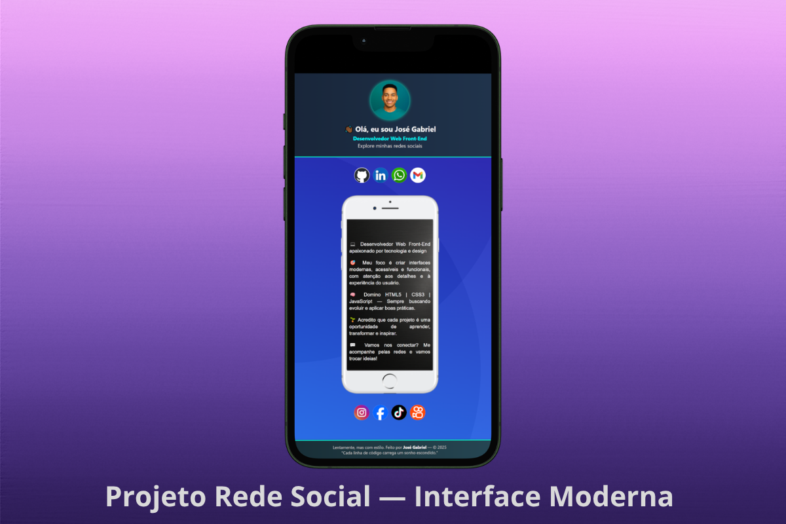
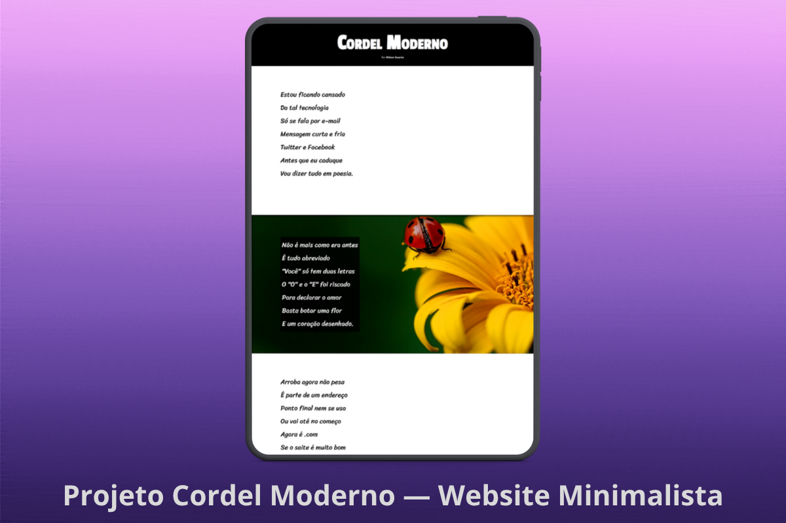
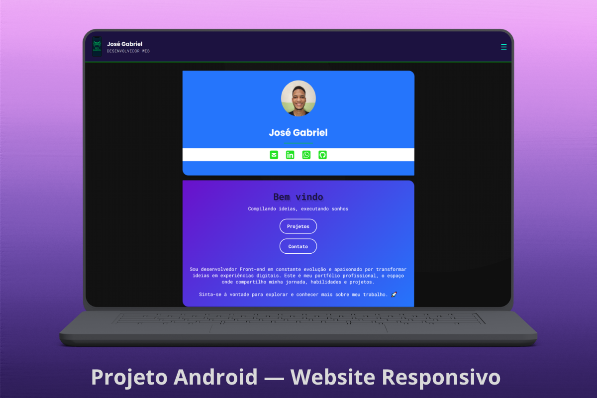

<!-- Onda Animada (Topo) -->

<!-- Linha Neon Animada -->

## 👋🏾 Olá! Eu sou José Gabriel

Sou um desenvolvedor **Front-End** focado em criar interfaces modernas, com atenção a **detalhes visuais, usabilidade e performance**.  
Busco sempre evoluir para entregar experiências digitais **bonitas, funcionais e eficientes**.

<!-- Linha Neon Animada -->

## 🛠️ Tecnologias & Ferramentas

<!-- Linha Neon Animada -->

## 🚀 Projetos em Destaque

### 📱 Projeto Social — Interface Moderna

Interface moderna simulando um smartphone com integração de redes sociais e design focado em experiência do usuário.

[🔗 Ver Projeto](#)

---

### 📜 Cordel Moderno — Website Minimalista

Projeto inspirado na cultura nordestina com tipografia estilizada e layout responsivo.

[🔗 Ver Projeto](#)

---

### 💻 Portfólio — Website Responsivo

Meu portfólio profissional com foco em UI moderna, responsividade e apresentação de projetos.

[🔗 Ver Projeto](#)

<!-- Linha Neon Animada -->

## 📊 Minhas Estatísticas

 

<!-- Linha Neon Animada -->

## 🐍 DevSnake — Cada Commit, um Passo

<!-- Linha Neon Animada -->

## 🌐 Onde me encontrar

---

<!-- Onda Final -->

